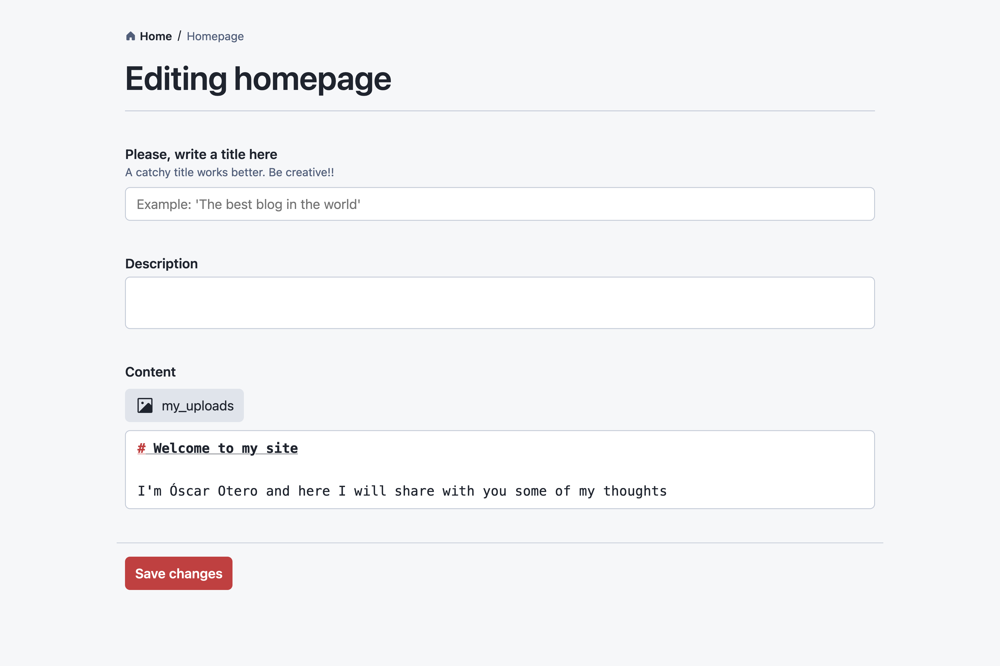

**LumeCMS** is a (yet another) CMS to manage site content. Despite its name, it
can be used with any generator, not only Lume, thanks to its agnostic design. In
this post, I want to dig into it and explain how it works.

<!-- more -->

## Why another CMS?

There are plenty of CMS and site builders out there. However, I didn't find any
CMS that meets my needs. Some of them are proprietary solutions, built for a
specific technology (mostly React components), or only work for popular
frameworks. Others are great but too expensive, or limiting.

The feeling of creating a website with a local server with live reload, where
any change made in your code editor is automatically updated in the browser
should be available also for non-developers. Some site builders allow to
"design" the website with a WYSIWYG solution but at the cost of high
vendor-locking. LumeCMS tries to find a solution where the CMS is completely
agnostic, but at the same time, can connect with the generator to get reliable
previews automatically.

## How it works

LumeCMS is divided into the following elements:

- **Storage:** It's the abstraction used by LumeCMS to read and write data from
  different origins, like the file system, databases, APIs, etc.
- **Documents:** A document represents a page or an entity of your site. For
  example, the home page.
- **Collections:** It's a collection of documents with the same data structure.
  For example, the posts in a blog.
- **Uploads:** Uploads are folders where you can upload files like images,
  videos, PDFs, etc.
- **Fields:** A field represents a value type and the UI used to edit this
  value. For example, the "text" field represents a text value and displays an
  `<input type="text">` in the interface.

### Configuration

LumeCMS is very similar to Lume in the way it's configured: Create a
configuration file, import the LumeCMS main module, create an instance,
configure the instance and export it. For example:

```js
import lumeCMS from "lume_cms/mod.ts";
import Kv from "lume_cms/src/storage/kv.ts";

const cms = lumeCMS({
  site: {
    name: "My awesome blog",
    url: "https://example.com",
  },
});

// Create a file system storage to the ./src directory.
cms.storage("my_fs", "src");

// Create a Kv storage to use a Deno.Kv database
const kv = await Deno.open();
cms.storage("my_database", new Kv({ kv }));

// Create a document to edit the homepage (index.md file)
cms.document("homepage", "my_fs:index.md", [
  "title: text",
  "description: textarea",
  "content: markdown",
]);

// Create a collection to edit some posts
cms.collection("posts", "my_fs:posts/*.md", [
  "title: text",
  "tags: list",
  "content: markdown",
]);

// Create a collection of people and store the data in the Kv database
cms.collection("people", "my_database:people", [
  "name: text",
  "birthdate: date",
  "bio: markdown",
]);

// Configure a folder to upload files
cms.upload("my_uploads", "my_fs:uploads");

// Export the cms configuration
export default cms;
```

As you can see, the configuration is very simple. Instead of strings like
`title: text`, it's also possible to define the fields using objects, useful if
you want to configure other options like label, description, or validation:

```js
{
  name: "title",
  type: "text",
  label: "Please, write a title here",
  description: "A catchy title works better. Be creative!!",
  attributes: {
    required: true,
    placeholder: "Example: 'The best blog in the world'",
  }
}
```

### Run the CMS

You can run the CMS directly in the configuration file but it's recommended to
use a different file. LumeCMS uses [Hono](https://hono.dev/) under the hood to
manage all routes and serve static files:

```ts
import cms from "./cms_config.ts";

// Init the CMS and return a Hono instance with the app
const app = cms.init();

// Run a local server with your CMS
Deno.serve(app.fetch);
```

Run this file to start the CMS (`deno run --unstable-kv -A run.ts`) and open the
URL `http://localhost:8000` in your browser. You will see a page like this:


The `posts` and `people` collections, `homepage` document, and `my_uploads`
upload folder is available for editing!

If you go into the Homepage, for example, you will see the fields to edit the
content:



## Lume integration

LumeCMS has an adapter for Lume SSG to automatically configure the site preview
while you edit it. This integration will be available in the next version of
Lume by running the command `deno task lume cms`, but it's also possible to use
manually with the following code:

```js
import lumeAdapter from "lume_cms/adapters/lume.ts";
import site from "./_config.ts";
import cms from "./_cms.ts";

// Return a Hono instance with the site + cms
const app = lumeAdapter({ site, cms });

// Run the server
Deno.serve(app.fetch);
```

After connecting Lume and LumeCMS, you will see the "Edit this page" button at
the botton-right corner of the browser window:


After clicking in the button, you can edit the page content in the CMS and
preview the changes after saving:


Let me know if you want to help creating integrations for other frameworks like
Eleventy, Hugo, etc.

## Installation

You can import LumeCMS from the
`https://cdn.jsdelivr.net/gh/lumeland/cms@{version}` URL, so it's recommended to
configure your import map as follows:

```json
{
  "imports": {
    "lume_cms/": "https://cdn.jsdelivr.net/gh/lumeland/cms@v0.2.0/"
  }
}
```

### Why don't use deno.land/x repository?

[I've tried](https://deno.land/x/lume_cms) but LumeCMS needs access to
client-side files like SVG icons and CSS code and deno.land/x repository returns
CORS errors for these formats. A CDN like
[jsdelivr.com](https://www.jsdelivr.com/), allows both Deno and browser access,
and it's really fast, so it works much better.

## Deployment

### Deno Deploy

Due Deno Deploy cannot write files, it's not possible to provide a live-preview
mode. But if you only need a UI to edit the site data, it's possible to use the
GitHub storage method to send changes directly to the GitHub repository. Instead
of a file system storage, use the GitHub storage:

```js
import lumeCms from "lume_cms/mod.ts";
import GitHub from "lume_cms/storage/github.ts";
import { Octokit } from "npm:octokit";

const cms = lumeCms();

// Register GitHub storage
cms.storage(
  "gh",
  new GitHub({
    client: new Octokit({ auth: Deno.env.get("GITHUB_TOKEN") }),
    owner: "oscarotero",
    repo: "test",
  }),
);

// Now you can create documents, collections, and uploads using the gh storage:
cms.collection("posts", "gh:posts", [
  "title: text",
  "tags: list",
  "draft: checkbox",
  "content: markdown",
]);

export default cms;
```

You can see a demo at [lume-cms-demo.deno.dev](https://lume-cms-demo.deno.dev/)
and the [code repository](https://github.com/lumeland/cms-demo).

### Hosting a full-featured CMS

To host a CMS including the live-preview feature, you need a hosting with Deno
CLI installed. I'm planning to create a Docker image and document all the steps
anytime soon.

Note that LumeCMS is still in the early stages and bugs and changes are
expected. If you want to give it a try, your feedback will be appreciated. Thank
you!
